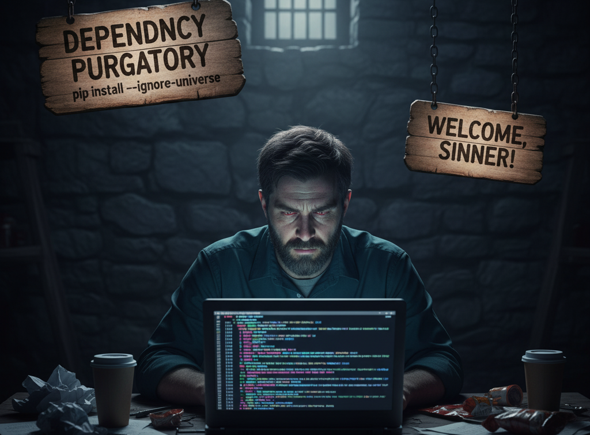

# Python Projects With Less Pain: Beginner's Guide to Virtual Environments

<p align="center">

</p>

## Dead in the Water

I don't know about you, but my computer still has Python 3.9.6 installed. And just like every October, an old version of Python is being deprecated. This year just happens to be, you guessed it, Python 3.9. Surprise, surprise, stuff is starting to break.

## To Update or Not to Update, is that the Question?

Sure, I could update Python. As tempting as that sounds, it won't solve all my problems.

Have you evern tried running a tutorial only to get an endless string of vague and frustrating error messages? Most of those are caused by:

- Dependency conflicts (i.e. a pandas update breaks compatability)
- Version conflict (a mismatch between your system and the tutorial)

Anyone remember pandas version 1.3.5? There was a breaking change around that version which wasn't backwards compatible with a critical piece of code I'd written. I'm almost embarassed to admit how long it took me to figure it out. But when you have code that was written more than three years ago, this is pretty common.

That's just part of code updates and improvements, right?

I should just periodically review and rewrite my code, you say?

Well, kind of.

## The Real World: Cloud Edition

<p align="center">

</p>

I mainly work in cloud environments and need to be familiar both with seting up and using environments that are consistent across different cloud resources as well as work within the constraints of a system that has been predefined.

Ever heard a software developer say "But it works on my computer"? This is the cloud, except for everyone.

AWS is a great example of this. Sagemaker Studio AI usually has kernals that are pretty up-to-date, but the pre-configured resources for running pipelines tend to be just ahead of (or sometimes just behind) deprecation. As of October 15, 2025 here is a common set of environments:

- Stable Python relase: Python 3.14
- ml.t3.medium Sagemaker kernal: Python 3.12.9
- Preconfigured pipeline resources: Python 3.9

## The Price of Easy

Python is popular because it's easy, but also because there is a plethora of libraries that cover just about any use case or situation. The big libraries that most of us rely on (like pandas, numpy, scipy, and scikit-learn to name just a few) get updated regularly. And each update is only compatible with certain versions of Python, usually those available and active at the time the update was released.

What does this mean? It means that if I prototype in my local environment with a freshly updated version of Python (3.14) or even in a Sagemaker instance (Python 3.12), that same code is highly unlikely to run in my pipeline (Python 3.9).

## Environments, Virtual Environments

Cloud environments are like Bond, everyone wants to do what they can do. And when it comes to data science, they're the defacto solution unless you're running tiny datasets and predicting manually and/or offline.

So just like Bond needs a license to kill, you need to use virtual environments.

Virtual environments make matching the pace of updates vs resources a breeze and gives you these benefits:

- Isolate Python and package versions per project/code base
- Make your code portable across systems and cloud platforms
- Avoid dependency purgatory

<p align="center">

</p>

## May The `venv` Be With You

It's easy to get started. I learned a handly workflow in the University of Washington's [Certificate in Python Programming](https://www.pce.uw.edu/certificates/python-programming).

1. On the command line, navigate to the project you're working on. If we use the folder structure of my [old blog](https://julielinx.github.io/)'s repo [datascience_diaries](https://github.com/julielinx/datascience_diaries) it'd look something like this: `cd datascience_diaries/devto_posts/00_resources`
1. Create a virtual environment: `python -m venv .venv`
    - In your environment the first command might be `python` or might be `python3` depending on how you have python set up on your system
    - `-m` indicates that we want to run a python module/library/package
    - `venv` is the module we want to run
    - `.venv` is what we want to call the virtual environment. You can call it anything, even something like `platapus` or `tree_beard`. However, if you call it `.venv` there is a chance that VSCode will automatically recognize it as an environment to use
1. Activate the environment
    - On Mac: `source .venv/bin/activate`
    - On PC: `.venv\Scripts\activate`

That's it. In your command line at the front of the line you should see something like `(.venv)`, which let's you know that it's active. To deactivate it just type `deactivate`.

If you type `pip list`, as of October 15, 2025, you should only see two entries: pip and setuptools.

I recommend using a `requirements.txt` file to specify any/all packages to want to use in the environment so that it's easy to set up, break down, and change.

To populate your `requirements.txt` file, just type the packages you need and the version you're using. For example:

```
matplotlib==3.9.4
numpy==2.0.2
pandas==2.3.3
scikit-learn==1.6.1
seaborn==0.13.2
```

\* **Pro Tip** \*: They're easier to find and update if you put them in alphabetically order.

There are more comprehensive ways to set it up that involve commands like `pip list`, but to start, just include the libraries you need. When you need the more complicated version, google it.

To load the libraries to your active environment (you remembered to activate the virtual environment, right?) at the command line type:

`pip install -r requirements.txt`

- The first command will probably be `pip` however it might be `pip3` depending on the environment setup
- `-r` tells `pip install` that we'll be supplying a file, not a package name
- `requirements.txt` is the name of your requirements file. You *can* name this anything you want, but to make things easier for your future self and anyone else that reads your code, I suggest you stick with `requirements.txt`

That's all there is to it. You now have an active virtual environment.

Just don't forget to `deactivate` it when you're done with it.

## In Case You Forgot

- Create a virtual environment
    - `python -m venv .venv`
- Activate it
    - Mac: `source .venv/bin/activate`
    - PC: `.venv\Scripts\activate`
- Install packages
    - `pip install -r requirements.txt`
- Deactivate when done
    - `deactivate`